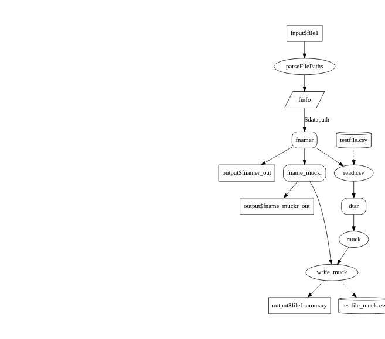

Readme
================

## Scope

This is a very small sample shiny app to illustrate how to work with
files in the server operating system in a reactive mode.

Even when run on one’s own local computer, a Shiny app contains both a
client part and a server part that communicate through the TCP/IP
network. Thus, the included `fileInput` function supplied with shiny
works by “uploading” files through the network from the browser
environment, and `downloadHandler` saves files by transferring them
through the network to the users Downloads directory (typically), even
though both parts of Shiny may well be running on the same computer if
your use case isn’t for public consumption.

It can be simpler and more efficient to simply load files into the Shiny
R server using normal file read and write functions, but in a GUI having
a user dialog to give control over which files are read or written to is
still needed. Enter the `shinyFiles` package, which encapsulates this
functionality.

## Reactive flow

Shiny is designed to be reactive… thinking along the lines of a flow of
data that propagates only when an output needs it is a key idea to get
used to. For best results, refer to the data flow diagram below and the
source code while reading the following explanation.

This app does not present a button to open a dialog to select an input
filename, a text input to specify an output file name, and a button to
trigger processing the file. Instead, clicking the “File Select” button
and completing the dialog puts the reactive objects that depend on the
input filename into a state of being out-of-date. This includes the
`file1summary` output text box, which Shiny then tries to update via the
`renderText` reactive named `output$file1summary`. The code in this
reactive retrieves the values of the `dtar` and `fname_muckr` reactives,
and passes the former to the `muck` function that modifies the data
frame it is given, and then passes the modified data frame and the value
from `fname_muckr` to the `write_muck` function.

The act of retrieving the value of the `dtar` reactive triggers the
reactive code. That checks that `fnamer` is valid, and aborts if the
user has not yet specified a filename using the `req` function. If the
`fnamer` reactive is ready, then the file is read from the server side
file system and a data frame is returned.

The `fname_muckr` function automatically derives a filename to write the
file into based on the name of the file from which data was read. This
is a process optimization that simplifies the app. It is also possible
to specify the name of the output file as a `textInput` that doesn’t get
used until the input file name is changed, but this can to files being
written when you don’t want them to be written. If you really want to
setup a gated workflow that doesn’t write until you push a button, then
read about `observeEvent` (e.g. [Mastering
Shiny](https://mastering-shiny.org/reactivity-objects.html#observers-details)),
but keep in mind that such magic can easily turn your logic into
spaghetti unless used sparingly.

The `shinyFileChoose` function in the server enables reactive behavior
that hides an `observeEvent manager` with a file dialog. The value
obtained when the user pushes the button is stored internally, and is
retrieved using the `parseFilePaths` function.

This is an intentionally simplified example of how to focus on using a
reactive data flow… it is not “useful” on its own.

### Data flow diagram

<!-- -->

## Web Inputs

- `input$file1`: character, path to selected input file

## Web Outputs

- output\$file1summary

## Functions

- `parseFilePaths`: function, works in conjunction with
  `shinyFileChoose` to provide a data frame of one or more rows
  describing the file name and directory.
- `finfo`: data frame, containing name of file and full path to file
  (`datapath`).
- `read.csv`: function, any R input function can be used as needed… this
  is just to show how it is used.
- `muck`: function to serve as an example of doing “something” to a data
  frame.
- `fname_muckr`: sample way to create an output filename based on the
  input filename.
- `write_muck`: function to write out the modified data frame to a new
  output file. Returns something to display on the screen to indicate
  whether it succeeded… in this case, the number of rows that were
  processed. The item to display on the screen is not important of
  itself, but the fact that it needs to be displayed is what causes
  Shiny to start working through the dependency graph of the reactive
  objects, causing the the whole chain of dependencies to be executed.

## Reactives

- `fnamer`: reactive path to input filename. As this is updated, any
  reactives that depend upon it and get directly or indirectly triggered
  by a need to display output will get updated.
- `dtar`: reactive data frame containing contents of input file.
